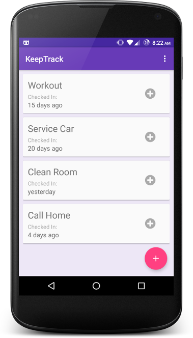
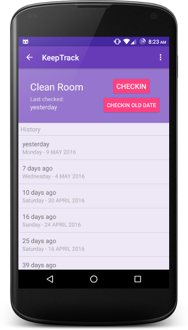
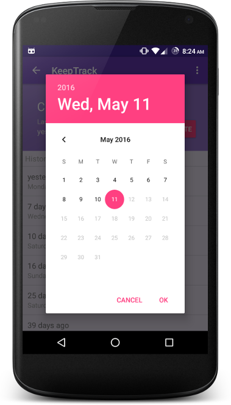
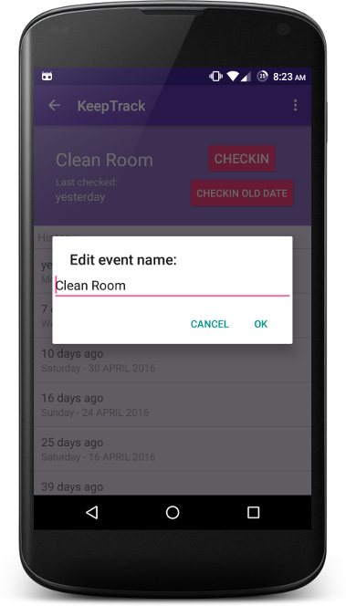

## KeepTrack

A simple app to keep track of stuff!

### Stuff used to make this:

* [SQLite](https://www.sqlite.org/index.html)
* [Android CardView](https://developer.android.com/guide/topics/ui/layout/cardview)
* [Android Design Library](https://guides.codepath.com/android/Design-Support-Library)

### Screenshots

 

### Demo
[Download from PlayStore](https://github.com/shahzar/KeepTrack/raw/master/KeepTrack.apk)
